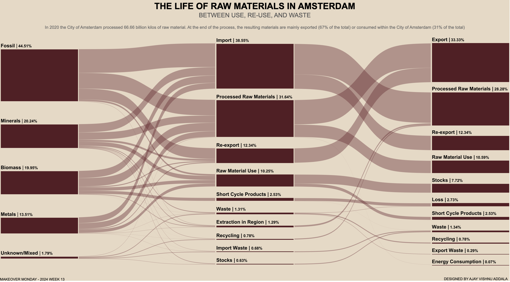

# Make Over Monday Challenge - Week 13, 2024

This repository contains my submission for Week 13 of the Make Over Monday challenge for the year 2024. The dataset provided focuses on the life of raw materials in Amsterdam.

## Tableau Visualization

I utilized Tableau to create a visual representation of the data. The primary visualization chosen for this submission is a Sankey plot. It's my first time attempting this visualization type, and I found it particularly insightful for showcasing the flow of materials.

### Snapshot

### Tableau Public Visual
[Link to Tableau Public Visualization](https://public.tableau.com/app/profile/ajay.vishnu.addala/viz/ThelifeofrawmaterialsinAmsterdamMOM2024Week13/RawMaterialsinAmsterdam)

## Inspiration and Resources

I drew inspiration from Ken Flerlage's tutorial on Sankey plots in Tableau for this visualisation. His detailed explanation and approach provided valuable insights, which I incorporated into my visualization.

### Ken Flerlage's Tutorial
[Link to Ken Flerlage's Sankey Plot Tutorial](https://www.flerlagetwins.com/2019/04/more-sankey-templates.html)

## Repository Contents

- Contains the updated dataset used for the visualization.
  Tableau workbook file containing the visualization.
- Snapshot image of the Sankey plot.

## Acknowledgments

I would like to thank Ken Flerlage for his excellent tutorial on Sankey plots. Additionally, I appreciate the Make Over Monday community for providing the dataset and continuous inspiration for data visualization challenges.

Please explore the visualization and give any feedback or suggestions for improvement.
